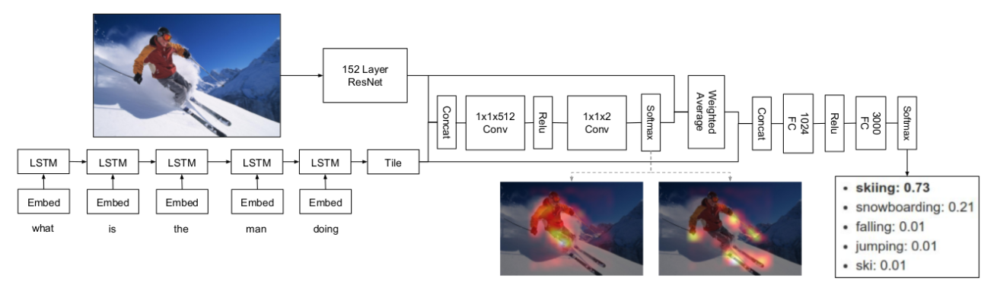

# Awesome Visual Question Answering

A reading list of resources dedicated to visual(image/video) question answering.

## Contributing
Please feel free to contact [me](http://jameschuanggg.github.io). Issues and PRs are also welcome.

## NEWS: Latest State-of-The-Art
Vahid Kazemi, Ali Elqursh, **Show, Ask, Attend, and Answer:
A Strong Baseline For Visual Question Answering**, 			arXiv:1704.03162, 2016. [[Paper]](https://arxiv.org/abs/1704.03162)   

 

## Papers

### Review Papers
- Latest Papers
    - Kushal Kushal, and Christopher Kanan. ***Visual question answering: Datasets, algorithms, and future challenges.*** Computer Vision and Image Understanding (2017). [[Paper]](https://arxiv.org/abs/1610.01465)
    - Qi Wu, Damien Teney, Peng Wang, Chunhua Shen, Anthony Dick, and Anton van den Hengel. ***Visual question answering: A survey of methods and datasets.*** Computer Vision and Image Understanding (2017). [[Paper]](https://arxiv.org/abs/1607.05910)

### CLEVR QA
 - Latest Papers
    - Justin Johnson, Bharath Hariharan, Laurens van der Maaten, Li Fei-Fei, C. Lawrence Zitnick, Ross Girshick, **CLEVR: A Diagnostic Dataset for Compositional Language and Elementary Visual Reasoning**, CVPR 2017. [[Paper]](http://vision.stanford.edu/pdf/johnson2017cvpr.pdf)
    - Justin Johnson, Bharath Hariharan, Laurens van der Maaten, Judy Hoffman, Li Fei-Fei, C. Lawrence Zitnick, Ross Girshick, **Inferring and Executing Programs for Visual Reasoning**, arXiv:1705.03633, 2017. [[Paper]](https://arxiv.org/abs/1705.03633) 
    - Ronghang Hu, Jacob Andreas, Marcus Rohrbach, Trevor Darrell, Kate Saenko, **Learning to Reason: End-to-End Module Networks for Visual Question Answering**, 	arXiv:1704.05526, 2017. [[Paper]](https://arxiv.org/abs/1704.05526)
    - Adam Santoro, David Raposo, David G.T. Barrett, Mateusz Malinowski, Razvan Pascanu, Peter Battaglia, Timothy Lillicrap, **A simple neural network module for relational reasoning**,		arXiv:1706.01427, 2017. [[Paper]](https://arxiv.org/abs/1706.01427)

### Image QA
 - Latest Papers
    - Kushal Kafle, and Christopher Kanan. ***An Analysis of Visual Question Answering Algorithms.*** arXiv:1703.09684, 2017. [[Paper]](https://arxiv.org/abs/1703.09684)
    - Vahid Kazemi, Ali Elqursh, **Show, Ask, Attend, and Answer:
A Strong Baseline For Visual Question Answering**, 			arXiv:1704.03162, 2016. [[Paper]](https://arxiv.org/abs/1704.03162)
    - Hyeonseob Nam, Jung-Woo Ha, Jeonghee Kim, **Dual Attention Networks for Multimodal Reasoning and Matching**, 		arXiv:1611.00471, 2016. [[Paper]](https://arxiv.org/abs/1611.00471) 
    - Jin-Hwa Kim, Kyoung Woon On, Jeonghee Kim, Jung-Woo Ha, Byoung-Tak Zhang, **Hadamard Product for Low-rank Bilinear Pooling**, arXiv:1610.04325, 2016. [[Paper]](https://arxiv.org/abs/1610.04325)
    - Akira Fukui, Dong Huk Park, Daylen Yang, Anna Rohrbach, Trevor Darrell, Marcus Rohrbach, **Multimodal Compact Bilinear Pooling for Visual Question Answering and Visual Grounding**,	arXiv:1606.01847, 2016. [[Paper]](https://arxiv.org/abs/1606.01847) [[code]](https://github.com/akirafukui/vqa-mcb)
    - Kuniaki Saito, Andrew Shin, Yoshitaka Ushiku, Tatsuya Harada, **DualNet: Domain-Invariant Network for Visual Question Answering**. arXiv:1606.06108v1, 2016. [[Paper]](https://arxiv.org/pdf/1606.06108.pdf) 
    - Arijit Ray, Gordon Christie, Mohit Bansal, Dhruv Batra, Devi Parikh, **Question Relevance in VQA: Identifying Non-Visual And False-Premise Questions**, 	arXiv:1606.06622, 2016. [[Paper]](https://arxiv.org/pdf/1606.06622v1.pdf) 
    - Hyeonwoo Noh, Bohyung Han, **Training Recurrent Answering Units with Joint Loss Minimization for VQA**, 	arXiv:1606.03647, 2016. [[Paper]](http://arxiv.org/abs/1606.03647v1) 
    - Jiasen Lu, Jianwei Yang, Dhruv Batra, Devi Parikh, **Hierarchical Question-Image Co-Attention for Visual Question Answering**, 	arXiv:1606.00061, 2016. [[Paper]](https://arxiv.org/pdf/1606.00061v2.pdf) [[code]](https://github.com/jiasenlu/HieCoAttenVQA)
    - Jin-Hwa Kim, Sang-Woo Lee, Dong-Hyun Kwak, Min-Oh Heo, Jeonghee Kim, Jung-Woo Ha, Byoung-Tak Zhang, **Multimodal Residual Learning for Visual QA**, arXiv:1606.01455, 2016. [[Paper]](https://arxiv.org/pdf/1606.01455v1.pdf) 
    - Peng Wang, Qi Wu, Chunhua Shen, Anton van den Hengel, Anthony Dick, **FVQA: Fact-based Visual Question Answering**, arXiv:1606.05433, 2016. [[Paper]](https://arxiv.org/pdf/1606.05433.pdf)
    - Ilija Ilievski, Shuicheng Yan, Jiashi Feng, **A Focused Dynamic Attention Model for Visual Question Answering**, arXiv:1604.01485. [[Paper]](https://arxiv.org/pdf/1604.01485v1.pdf)
    - Yuke Zhu, Oliver Groth, Michael Bernstein, Li Fei-Fei, **Visual7W: Grounded Question Answering in Images**, CVPR 2016. [[Paper]](http://arxiv.org/abs/1511.03416) 
    - Hyeonwoo Noh, Paul Hongsuck Seo, and Bohyung Han, **Image Question Answering using Convolutional Neural Network with Dynamic Parameter Prediction**, CVPR, 2016.[[Paper]](http://arxiv.org/pdf/1511.05756.pdf)
    - Jacob Andreas, Marcus Rohrbach, Trevor Darrell, Dan Klein, **Learning to Compose Neural Networks for Question Answering**, NAACL 2016. [[Paper]](http://arxiv.org/pdf/1601.01705.pdf)
    - Jacob Andreas, Marcus Rohrbach, Trevor Darrell, Dan Klein, **Deep compositional question answering with neural module networks**, CVPR 2016. [[Paper]](https://arxiv.org/abs/1511.02799)
    - Zichao Yang, Xiaodong He, Jianfeng Gao, Li Deng, Alex Smola, **Stacked Attention Networks for Image Question Answering**, CVPR 2016. [[Paper]](http://arxiv.org/abs/1511.02274) [[code]](https://github.com/JamesChuanggg/san-torch)    
    - Kevin J. Shih, Saurabh Singh, Derek Hoiem, **Where To Look: Focus Regions for Visual Question Answering**, CVPR, 2015. [[Paper]](http://arxiv.org/pdf/1511.07394v2.pdf)        
    - Kan Chen, Jiang Wang, Liang-Chieh Chen, Haoyuan Gao, Wei Xu, Ram Nevatia, **ABC-CNN: An Attention Based Convolutional Neural Network for Visual Question Answering**, arXiv:1511.05960v1, Nov 2015. [[Paper]](http://arxiv.org/pdf/1511.05960v1.pdf)
    - Huijuan Xu, Kate Saenko, **Ask, Attend and Answer: Exploring Question-Guided Spatial Attention for Visual Question Answering**, arXiv:1511.05234v1, Nov 2015. [[Paper]](http://arxiv.org/abs/1511.05234)
    - Kushal Kafle and Christopher Kanan, **Answer-Type Prediction for Visual Question Answering**, CVPR 2016.  [[Paper]](http://www.cv-foundation.org/openaccess/content_cvpr_2016/html/Kafle_Answer-Type_Prediction_for_CVPR_2016_paper.html) 
    - Stanislaw Antol, Aishwarya Agrawal, Jiasen Lu, Margaret Mitchell, Dhruv Batra, C. Lawrence Zitnick, Devi Parikh, **VQA: Visual Question Answering**, ICCV, 2015. [[Paper]](http://arxiv.org/pdf/1505.00468)
    - Stanislaw Antol, Aishwarya Agrawal, Jiasen Lu, Margaret Mitchell, Dhruv Batra, C. Lawrence Zitnick, Devi Parikh, **VQA: Visual Question Answering**, ICCV, 2015. [[Paper]](http://arxiv.org/pdf/1505.00468) [[code]](https://github.com/JamesChuanggg/VQA-tensorflow)
    - Bolei Zhou, Yuandong Tian, Sainbayar Sukhbaatar, Arthur Szlam, Rob Fergus, **Simple Baseline for Visual Question Answering**, arXiv:1512.02167v2, Dec 2015. [[Paper]](http://arxiv.org/abs/1512.02167)
    - Hauyuan Gao, Junhua Mao, Jie Zhou, Zhiheng Huang, Lei Wang, Wei Xu, **Are You Talking to a Machine? Dataset and Methods for Multilingual Image Question Answering**, NIPS 2015. [[Paper]](http://arxiv.org/pdf/1505.05612.pdf)
    - Mateusz Malinowski, Marcus Rohrbach, Mario Fritz, **Ask Your Neurons: A Neural-based Approach to Answering Questions about Images**, ICCV 2015. [[Paper]](http://arxiv.org/pdf/1505.01121v3.pdf)
    - Mengye Ren, Ryan Kiros, Richard Zemel, **Exploring Models and Data for Image Question Answering**, ICML 2015. [[Paper]](http://arxiv.org/pdf/1505.02074.pdf)
    - Mateusz Malinowski, Mario Fritz, **Towards a Visual Turing Challe**, NIPS Workshop 2015. [[Paper]](http://arxiv.org/abs/1410.8027)
    - Mateusz Malinowski, Mario Fritz, **A Multi-World Approach to Question Answering about Real-World Scenes based on Uncertain Input**, NIPS 2014. [[Paper]](http://arxiv.org/pdf/1410.0210v4.pdf)
     
 - Attention-Based
    - Jin-Hwa Kim, Kyoung Woon On, Jeonghee Kim, Jung-Woo Ha, Byoung-Tak Zhang, **Hadamard Product for Low-rank Bilinear Pooling**, arXiv:1610.04325, 2016. [[Paper]](https://arxiv.org/abs/1610.04325)
    - Akira Fukui, Dong Huk Park, Daylen Yang, Anna Rohrbach, Trevor Darrell, Marcus Rohrbach, **Multimodal Compact Bilinear Pooling for Visual Question Answering and Visual Grounding**,	arXiv:1606.01847, 2016. [[Paper]](https://arxiv.org/abs/1606.01847)
    - Hyeonwoo Noh, Bohyung Han, **Training Recurrent Answering Units with Joint Loss Minimization for VQA**, 	arXiv:1606.03647, 2016. [[Paper]](http://arxiv.org/abs/1606.03647v1) 
    - Jiasen Lu, Jianwei Yang, Dhruv Batra, Devi Parikh, **Hierarchical Question-Image Co-Attention for Visual Question Answering**, 	arXiv:1606.00061, 2016. [[Paper]](https://arxiv.org/pdf/1606.00061v2.pdf)
    - Zichao Yang, Xiaodong He, Jianfeng Gao, Li Deng, Alex Smola, **Stacked Attention Networks for Image Question Answering**, CVPR 2016. [[Paper]](http://arxiv.org/abs/1511.02274)    
    - Ilija Ilievski, Shuicheng Yan, Jiashi Feng, **A Focused Dynamic Attention Model for Visual Question Answering**, arXiv:1604.01485. [[Paper]](https://arxiv.org/pdf/1604.01485v1.pdf)
    - Kan Chen, Jiang Wang, Liang-Chieh Chen, Haoyuan Gao, Wei Xu, Ram Nevatia, **ABC-CNN: An Attention Based Convolutional Neural Network for Visual Question Answering**, arXiv:1511.05960v1, Nov 2015. [[Paper]](http://arxiv.org/pdf/1511.05960v1.pdf)
    - Huijuan Xu, Kate Saenko, **Ask, Attend and Answer: Exploring Question-Guided Spatial Attention for Visual Question Answering**, arXiv:1511.05234v1, Nov 2015. [[Paper]](http://arxiv.org/abs/1511.05234)
  
 - Knowledge-based
    - Peng Wang, Qi Wu, Chunhua Shen, Anton van den Hengel, Anthony Dick, **FVQA: Fact-based Visual Question Answering**, arXiv:1606.05433, 2016. [[Paper]](https://arxiv.org/pdf/1606.05433.pdf)
    - Qi Wu, Peng Wang, Chunhua Shen, Anton van den Hengel, Anthony Dick, **Ask Me Anything: Free-form Visual Question Answering Based on Knowledge from External Sources**, CVPR 2016. [[Paper]](http://arxiv.org/abs/1511.06973)
    - Peng Wang, Qi Wu, Chunhua Shen, Anton van den Hengel, Anthony Dick, **Explicit Knowledge-based Reasoning for Visual Question Answering**, arXiv:1511.02570v2, Nov 2015. [[Paper]](http://arxiv.org/abs/1511.02570)
    - Yuke Zhu, Ce Zhang, Christopher Re,́ Li Fei-Fei, **Building a Large-scale Multimodal Knowledge Base System for Answering Visual Queries**, arXiv:1507.05670, Nov 2015. [[Paper]](http://arxiv.org/abs/1507.05670)

 - Memory Network
    - Caiming Xiong, Stephen Merity, Richard Socher, **Dynamic Memory Networks for Visual and Textual Question Answering**, ICML 2016. [[Paper]](http://arxiv.org/abs/1603.01417)
    - Aiwen Jiang, Fang Wang, Fatih Porikli, Yi Li, **Compositional Memory for Visual Question Answering**, arXiv:1511.05676v1, Nov 2015. [[Paper]](http://arxiv.org/abs/1511.05676)

### Video QA
  - Kuo-Hao Zeng, Tseng-Hung Chen, Ching-Yao Chuang, Yuan-Hong Liao, Juan Carlos Niebles, Min Sun, **Leveraging Video Descriptions to Learn Video Question Answering**, AAAI 2017. [[paper]](https://arxiv.org/abs/1611.04021)
  - Makarand Tapaswi, Yukun Zhu, Rainer Stiefelhagen, Antonio Torralba, Raquel Urtasun, Sanja Fidler, **MovieQA: Understanding Stories in Movies through Question-Answering**, CVPR 2016. [[Paper]](http://arxiv.org/abs/1512.02902)
  - Linchao Zhu, Zhongwen Xu, Yi Yang, Alexander G. Hauptmann, **Uncovering Temporal Context for Video Question and Answering**, arXiv:1511.05676v1, Nov 2015. [[Paper]](http://arxiv.org/abs/1511.04670)
